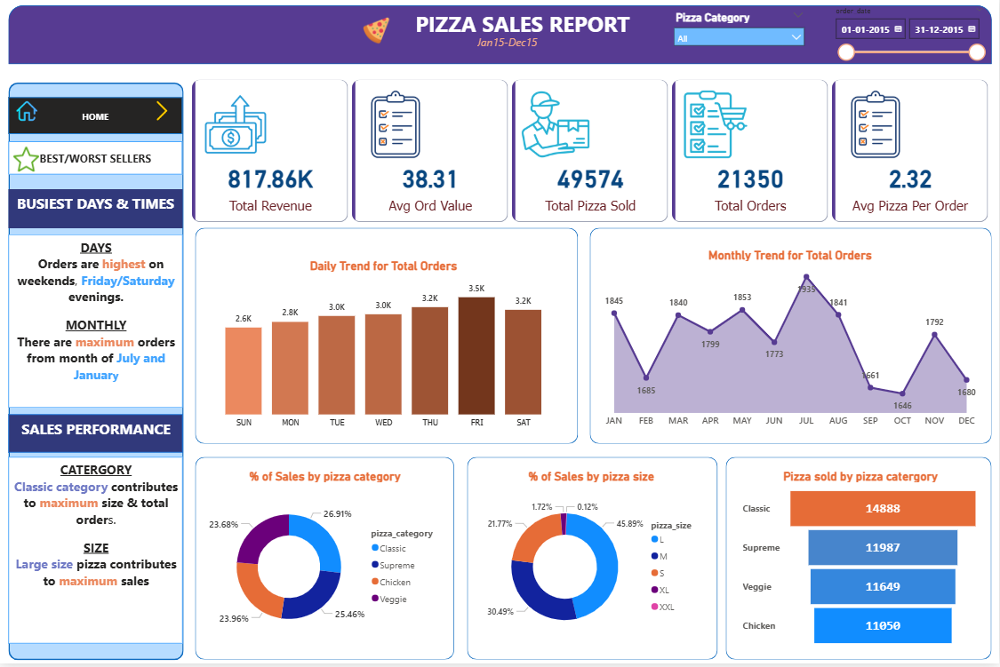

# 🍕 Pizza Sales Dashboard

## 🔍 Objective
Analyze pizza sales data to uncover customer behavior, product performance, and revenue trends.

---

## 🛠️ Tools Used
- SQL Server  
- Power BI  
- DAX  

---

## ⚙️ Approach
- Stored raw data in SQL Server database (*pizza_db*)  
- Connected Power BI to SQL Server  
- Used SQL queries to validate KPI calculations  
- Built KPIs and measures using DAX  
- Designed an interactive dashboard  

---

## 📈 Key Insights

### 📅 Demand Patterns
- Orders peak on weekends, especially Friday and Saturday evenings  
- Highest demand observed in January and July  

### 💰 Sales Performance
- Classic category contributes the most to total orders and revenue  
- Large size pizzas drive maximum sales  

### 🥇 Best-Selling Products
- Thai Chicken Pizza generates the highest revenue  
- Classic Deluxe Pizza leads in quantity and total orders  

### 🥉 Underperforming Products
- Brie Carre Pizza contributes the least in revenue and orders  

---

## 📷 Dashboard Preview

---

## 💡 Note
This project demonstrates foundational skills in SQL validation and Power BI dashboarding.
